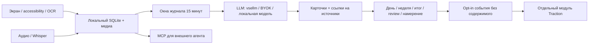

# Screenpipe: проверка продукта и план развития

> UI update, 22 September: statistics now has seven English metric sections and charts first. The earlier 13-section description is historical. Product alternatives and experiments are in [USE_CASE_OPTIONS.md](USE_CASE_OPTIONS.md).

Проверено 22 сентября 2026 по исходникам `39ebfb765`, документации, локальным
настройкам и health/logs. Из командного обсуждения использован только
фрагмент о Screenpipe 19:08–22:01. Слова из обсуждения — намерения команды;
наличие кода, работа установленной сборки и доказанная польза проверяются отдельно.

## Главное

Это **внутренняя альфа журнала на базе Screenpipe**, достаточно развитая для
пилота, но не готовый массовый продукт. Код основных экранов уже есть; не
подтверждены надёжный первый запуск, повседневная польза, качество на реальных
днях, полная экономика, ресурсный бюджет и поставка всех платформ.

Оценка «почти всё сделано» неверна: roadmap смешивал наличие функций с
завершённым пользовательским сценарием. Рабочий критерий — человек установил,
получил понятную первую карточку, проверил источник, восстановил задачу или
использовал итог, а затем вернулся добровольно.

## Почему установленное приложение выглядит иначе

Обнаружен процесс из `/Volumes/screenpipe/screenpipe.app`, версия **2.7.27**.
Это запуск прямо с DMG. Исходники уже **2.7.28** с журналом как основным экраном.
В старом профиле `uiLanguage` не задан; кроме того, first-run banner содержит
английские литералы. Даже `uiLanguage=ru` не переводит весь интерфейс.
Предыдущее утверждение о русском интерфейсе по умолчанию было слишком широким.

В логах 22.09 в 10:46:17 UTC: `disk_pressure`, доступно 17 769 726 929 байт,
порог 21 474 836 480 байт (**20 GiB**). Захват экрана остановлен. Health позже
показывал `degraded`, `frame_status=not_started`, ноль capture attempts/frames.
Аудио при этом имело активность. Баннер «screenpipe is ready» не объясняет
остановку. По этой сессии нельзя делать выводы о качестве журнала и ресурсах
нормально работающей записи.

Действия пользователя:

1. Освободить место выше порога с запасом. Не удалять записи автоматически.
2. Использовать [DMG 2.7.28 для Apple Silicon](https://disk.yandex.ru/d/WrsC1w1Mr69mnA),
   скопировать приложение в Applications, закрыть старый экземпляр и запустить новый.
   Эта готовая сборка ещё **не содержит** добавленную здесь телеметрию.
3. Проверить разрешения записи экрана, Accessibility и микрофона по выбранному режиму.
4. Открыть настройки AI: проверить vsellm endpoint, модель и доступ к провайдеру.
5. Проверить health и появление первого кадра, затем поработать обычным образом
   15–30 минут. Открыть журнал → карточку → исходный фрагмент. Недостаток данных,
   остановка захвата и ошибка модели должны различаться.
6. Для нового модуля статистики понадобится новая собранная версия; затем
   Настройки → Журнал → Traction, индивидуальный credential и отдельное согласие.

Это инструкция по текущим ограничениям. Нужный продуктовый результат P0 —
сделать эти шаги понятными внутри приложения, без чтения технической инструкции.

## Как всё связано

Rust отвечает за запись, базу, локальный HTTP API, генерацию и MCP. Tauri
оборачивает React/Next.js интерфейс. Генератор рассматривает 15-минутные окна,
может переписывать последние 45 минут; цикл проверки около минуты. Журнальный
день начинается в 04:00 локального времени. Это не непрерывная «истина» о действиях:
карточка — вывод модели по ограниченной выборке наблюдений.

## LLM и ключи

**Подтверждение команды: DeepSeek вызывается через vsellm напрямую из Screenpipe,
минуя общий шлюз MultiTool/Memento.** Слово «напрямую» здесь относится к vsellm,
а не к официальному endpoint DeepSeek.

| Режим | Маршрут | Авторизация |
|---|---|---|
| Текущий DeepSeek | Screenpipe → `https://api.vsellm.ru/v1` → upstream | Ключ доступа к vsellm |
| Custom/BYOK | Screenpipe → URL выбранного пресета | Ключ соответствующего endpoint |
| Ollama | Screenpipe → localhost:11434/v1 | Локальная модель/локальный сервис |
| Screenpipe Cloud | Screenpipe → api.screenpipe.com | Отдельная cloud-авторизация |
| MCP | Внешний агент → локальный API | Локальная авторизация; LLM агента настроена отдельно |

Для DeepSeek код ищет ключ в пресете, затем `DEEPSEEK_API_KEY`, затем
`SCREENPIPE_DEEPSEEK_API_KEY`, включённом при компиляции. В проверенном профиле
поле ключа пустое; секрет конкретного бинарника не извлекался. Поэтому нельзя
утверждать, что ключ отсутствует вообще, что запрос пройдёт, или кто оплачивает
его: это подтверждает provider check. Общий ключ вашей инфраструктуры не нужен
этому маршруту. В интерфейсе стоит показывать endpoint, источник credential и
успешность проверки, сохраняя сам секрет скрытым.

В запущенной 2.7.27 выбран `deepseek/deepseek-v4-flash-vision-exp`; в исходниках
новый default для текстовых карточек — `deepseek/deepseek-v4.1-flash`. Наличие
названия не гарантирует доступность модели у vsellm. Аудио использует отдельно
настроенный Whisper; это другой механизм и другая вычислительная нагрузка.

Общий compile-time credential подходит плохо для публичного распространения:
извлекаемость бинарника и общий лимит делают управление доступом трудным.
Выбор для пилота — индивидуальные vsellm credentials либо собственная выдача
индивидуального доступа. Это отдельное решение; перенос через общий шлюз не
предлагается как уже принятое требование.

## Что уже есть и что ещё не готово

Есть дневной журнал, неделя, дашборд, доказательства из истории, Markdown recap,
перегенерация, оценки карточек и интервалов, намерения и focus override, MCP
инструменты журнала. Focus nudges по умолчанию выключены; код содержит grace,
confidence и cooldown, а не полноценную верификацию полезности вмешательств.

Не закрыты устойчивые ручные правки карточек, split/merge, защита исправлений
при regeneration, полноценное «продолжить работу», понятный первый запуск и
сквозной учёт маршрута/ошибок/затрат. Нужен контроль качества по типам ошибок:
неверная тема, временные границы, выдуманное завершение задачи, ложное отвлечение.

Сохранённый eval: 8 синтетических примеров, категория 7/8, связь с целью 5/7,
около 4,9 с и 4755 токенов на окно. Оценка отвлечения 1/1 почти ничего не говорит
о precision в реальной работе. Это исходная точка для регрессий, не доказанная
точность и не тариф. Большой старый набор frontend имел 8 неуспешных тестов;
проверки нового изменения перечислены в описании PR.

## Аналоги и вывод

Сравнение основано на документации и исходниках, без практического одинакового
прогона всех приложений. Лицензии проверять по выбранной версии перед заимствованием.

| Продукт | Сильная сторона | Вывод для Screenpipe |
|---|---|---|
| [Dayflow](https://github.com/JerryZLiu/Dayflow), MIT, macOS | Автоматический журнал, итоги недели, экспорт, варианты локального и облачного AI | Ближайший продуктовый ориентир. [MCP/CLI уже есть](https://www.dayflow.so/integrations/), так что сам MCP не отличие. Нужна лучшая проверяемость и восстановление задачи. |
| [ActivityWatch](https://github.com/ActivityWatch/activitywatch), MPL-2.0 | Локальные детерминированные app/window/AFK watchers и статистика времени | Хорошая база сравнения временного покрытия. Не выдавать AI-классификацию за точный таймер. |
| [OpenRecall](https://github.com/openrecall/openrecall), AGPL-3.0 | Поиск по локальной истории скриншотов с OCR/embeddings | Показывает ценность «найти увиденное». Дневной рассказ сам по себе менее проверяем, чем найденный источник. |
| [Drifty](https://drifty.so/) | Автоматический учёт времени и помощь с фокусом | Сравнивать полезность вмешательства, а не число уведомлений. Открытая лицензия не подтверждена. |
| [Screenpipe upstream](https://github.com/screenpipe/screenpipe) | Слой контекста для агентов: экран, аудио, поиск, интеграции | Большая часть инфраструктуры уже унаследована. Собственный вклад — доверенный пользовательский сценарий поверх неё. |

[Alfric Journal](https://journal.alfric.io/) — редакционный журнал сайта, его нельзя
засчитывать как доказательство дневника пользовательской активности. У текущей
базы Screenpipe commercial/source-available лицензия: не называть весь форк MIT
по старому roadmap; условия распространения требуют отдельного решения владельцев.

Предлагаемое отличие: **«вернуться к конкретной работе с проверяемыми источниками»**.
Пользователь подтверждает, что сделано, сохраняет короткий итог и на следующий
день восстанавливает незавершённую задачу. Это связывает журнал, память и агента
в один проверяемый сценарий. Ещё один график рабочего времени слабее этого
сценария, потому что ActivityWatch уже даёт прозрачный учёт, а Dayflow — дневник.

## Порядок работ и критерии

1. **P0: запуск и доверие к состоянию.** Различать permissions/disk/capture/provider;
   перевести первый сценарий; показать один следующий шаг; подтвердить первый кадр
   и первый осмысленный результат. При остановке записи запрещено обещание ready
   — сделано в исходниках 23.09 для карточки первого запуска и trial-экрана
   (см. описание PR); причина «диск» в тексте движка — follow-up.
2. **P0: измерения и ключи.** Этот модуль, consent, per-install credentials;
   подключить first-run/native/LLM отправители после проверки Tauri; проверить,
   что outage телеметрии не мешает записи. Открыто показывать маршрут vsellm.
3. **P1: качество и review.** Защищённые правки, источники, split/merge, вечерний
   review. Разметить минимум 30 человеко-дней, заранее зафиксировать классы ошибок.
4. **P1: пилот 10–20 человек, 2 недели.** Проверять полезное действие и возврат,
   причины отказа, достоверность и нагрузку. «Три осмысленных дня» — стартовая
   гипотеза критерия, не доказанный industry benchmark.
5. **P1: экономика и нагрузка.** operation/attempt IDs, tokens/tariff, стоимость
   подтверждённого дня; восьмичасовой тест разных режимов с базовой линией.
6. **P2: восстановление задачи**, затем осторожная помощь с фокусом. Автооткрытие
   документов — по действию пользователя; вывод модели отделён от факта. Для
   nudges нужен реальный размеченный набор, false positives и доля отключений.
7. **Поставки:** сначала Mac arm64, затем отдельные платформенные проверки.
   Дата релиза определяется критериями, а не наличием экранов.

## Сборка и ресурсы

Текущий Mac: Apple Silicon, 16 ГБ RAM, 8 CPU, macOS 26.5.1, Xcode 26.5;
обнаружены Bun, Rust 1.94, cmake/pkg-config/ffmpeg. **Для нативной сборки всё ещё
не готово:** обязательный sccache не обнаружен, свободного места уже меньше
порога записи. Репозиторий требует общий build queue/cache; raw Cargo для
`src-tauri` не является допустимым обходом. Подписи обнаружены, но наличие
Developer ID и credentials notarization не подтверждено.

Канонический локальный цикл: в `apps/screenpipe-app-tauri` выполнить
`bun run dev:tauri`; разовая сборка — `bun run build:tauri:dev`; native-тесты —
`bun run test:tauri`. Предварительно восстановить disk/cache prerequisites.
Публикация приложения остаётся человеческим действием по правилам репозитория.

| Платформа | Реальное состояние |
|---|---|
| Mac arm64 | Есть распространяемые DMG; новые изменения требуют новой сборки/smoke. |
| Mac Intel | Rust target установлен; готовность библиотек и реальной машины не подтверждена. |
| Windows | База поддерживает; нужны Windows runner, MSVC/WebView2 и native QA форка. |
| Linux | База поддерживает; нужны Linux runner, WebKitGTK и проверка захвата в нужном окружении. |
| iOS/Android | Текущий desktop-форк не даёт мобильную поставку автоматически. |

Не обещать расход RAM/CPU/ГБ в день без замера работающего захвата. Режимы резко
различаются: экран/аудио, один/несколько мониторов, Whisper, cloud или локальная
LLM, idle и активная работа. Нужны p50/p95 CPU/RSS, фактический прирост хранения,
задержка карточек, доля покрытия и разряд батареи относительно baseline.
`measure_client.py` даёт только локальный короткий диагностический срез; он
не измеряет энергопотребление и не заменяет восьмичасовой тест.

## Что добавляет статистика

13 вкладок: продукт, основной сценарий, клиент/запись, LLM, расходы, ошибки,
функции, ограничения, приватность, MCP, план, аналоги, сборки. Реальные показатели
не подменяются планом. Неизмеряемые поля обозначены; пустой знаменатель — не ноль.
Инструментация UI уже есть в исходниках, но её нет в запущенном старом бинарнике.
Развёртывание Traction и поставка новой desktop-сборки — два отдельных результата.
